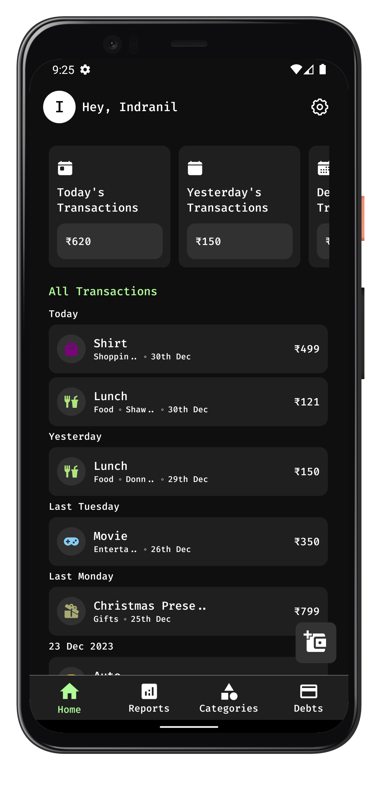
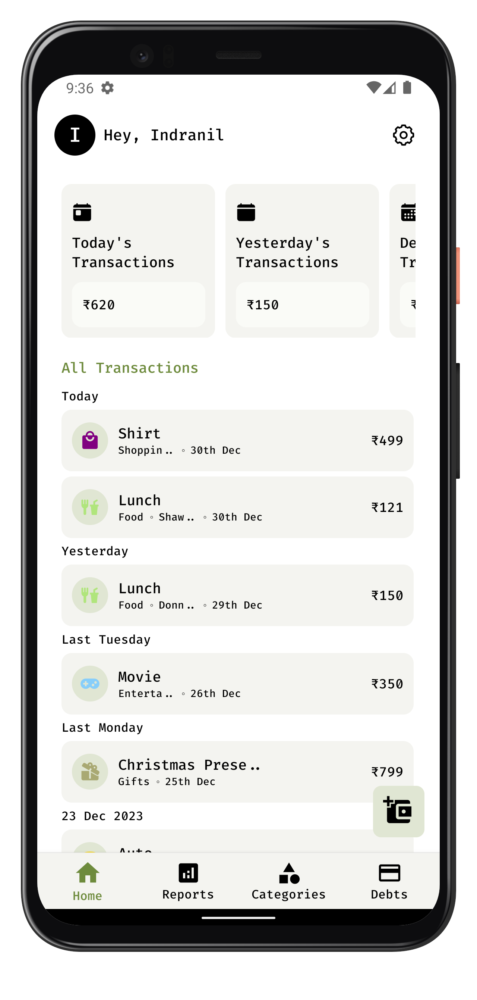
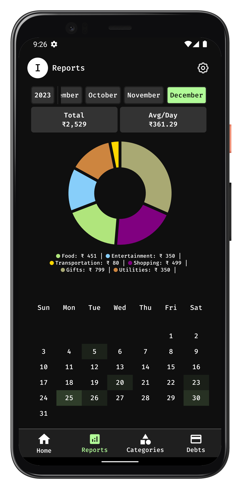
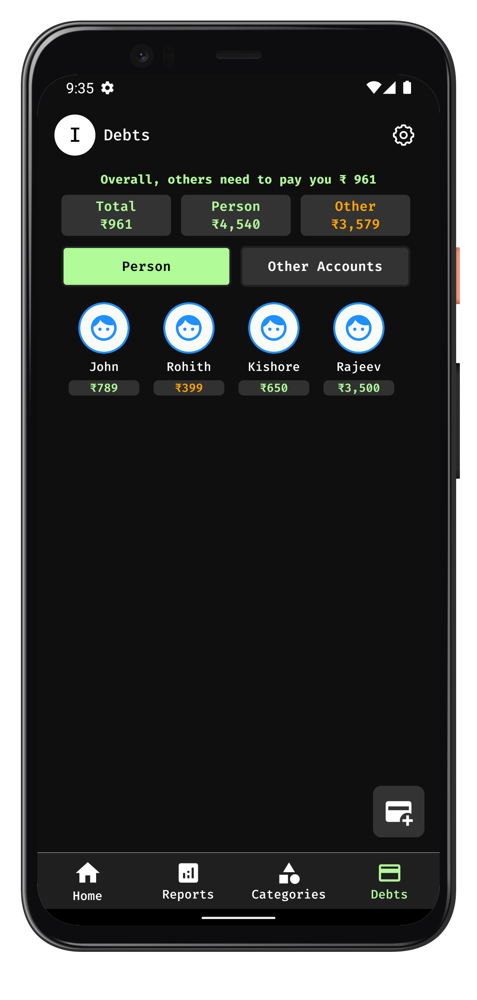
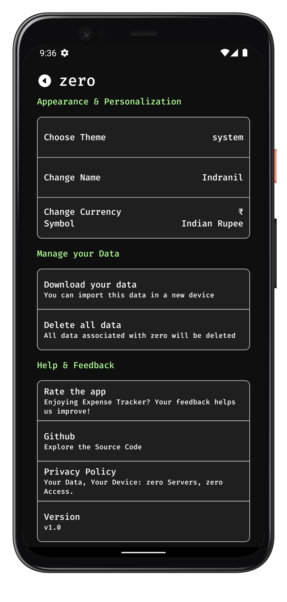
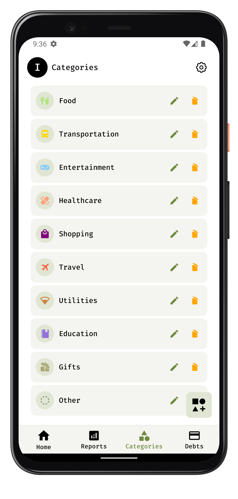

<div align="center">
    
    <h1 align="center">Tally - Personal Expense Manager</h1>
    <p align="center">
        <em>A privacy-focused, lightweight expense tracking application</em>
    </p>
</div>

<div align="center">

[](https://reactnative.dev/)
[](https://www.typescriptlang.org/)
[](LICENSE)
[](https://realm.io/)

</div>

---

## 📱 About Tally

**Tally** is a modern, open-source expense management application built with React Native. Designed with privacy at its core, Tally keeps all your financial data locally on your device—no servers, no tracking, no compromises.

Perfect for individuals who want to:
- 📊 Track daily expenses with ease
- 💰 Manage debts and loans
- 📈 Visualize spending patterns
- 🔒 Keep financial data completely private
- 🎨 Enjoy a beautiful, minimalist interface

## ✨ Key Features

### 💸 Expense Management
- **Quick Entry**: Add transactions in seconds with intuitive forms
- **Custom Categories**: Create and organize expenses your way
- **Flexible Editing**: Modify or delete any transaction with ease
- **Multi-Currency**: Support for multiple currency formats

### 📊 Analytics & Insights
- **Visual Reports**: Beautiful charts and graphs to understand spending patterns
- **Heat Maps**: See spending trends across months at a glance
- **Daily Averages**: Track average spending per day
- **Category Breakdown**: Know exactly where your money goes

### 💳 Debt Tracking
- **Borrowing & Lending**: Keep track of money owed and loaned
- **Debtor Management**: Organize multiple debtors with ease
- **Payment History**: Record all transactions related to debts

### 🎨 User Experience
- **Dark & Light Themes**: Choose your preferred visual style
- **Minimal Design**: Clean, distraction-free interface
- **Smooth Animations**: Delightful interactions throughout
- **Responsive Layout**: Works perfectly on all screen sizes

### 🔐 Privacy First
- **100% Local Storage**: All data stays on your device
- **No Account Required**: No email, no password, no sign-up
- **Zero Data Collection**: We don't track, store, or share anything
- **Export/Import**: Full control with JSON backup files
- **Open Source**: Transparent and auditable codebase

## 📸 Screenshots

<div align="center">
  
  
  
</div>

<div align="center">
  
  
  
</div>

## 🚀 Getting Started

### Prerequisites

Before you begin, ensure you have the following installed:
- **Node.js** (v16 or higher) - [Download](https://nodejs.org/)
- **Yarn** or **npm** - Package manager
- **React Native CLI** - `npm install -g react-native-cli`
- **Android Studio** (for Android) or **Xcode** (for iOS)

### Installation

1. **Clone the repository**
   ```bash
   git clone https://github.com/priyanshusaini105/tally.git
   cd tally
   ```

2. **Install dependencies**
   ```bash
   yarn install
   # or
   npm install
   ```

3. **Install iOS dependencies** (macOS only)
   ```bash
   cd ios && pod install && cd ..
   ```

### Running the App

#### Android
```bash
yarn android
# or
npm run android
```

#### iOS (macOS only)
```bash
yarn ios
# or
npm run ios
```

### Development

Start the Metro bundler:
```bash
yarn start
# or
npm start
```

## 🏗️ Tech Stack

- **Frontend**: React Native, TypeScript
- **State Management**: Redux Toolkit, Redux Saga
- **Database**: Realm (Local NoSQL)
- **Navigation**: React Navigation v6
- **Charts**: react-native-svg-charts
- **Icons**: React Native Vector Icons
- **Styling**: StyleSheet API with custom theme system

## 📁 Project Structure

```
tally/
├── src/
│   ├── components/         # Reusable UI components
│   │   ├── atoms/         # Basic building blocks
│   │   └── molecules/     # Composite components
│   ├── screens/           # App screens
│   ├── navigation/        # Navigation configuration
│   ├── redux/             # State management
│   │   ├── slice/        # Redux slices
│   │   └── saga/         # Side effects
│   ├── schemas/           # Realm database schemas
│   ├── hooks/             # Custom React hooks
│   ├── utils/             # Utility functions
│   └── styles/            # Global styles and themes
├── assets/
│   ├── fonts/            # Custom fonts
│   ├── images/           # Images and icons
│   ├── jsons/            # Default data and config
│   └── screenshots/      # App screenshots
├── android/              # Android native code
├── ios/                  # iOS native code
└── __tests__/           # Test files
```

## 🤝 Contributing

Contributions are welcome! Here's how you can help:

1. Fork the repository
2. Create a feature branch (`git checkout -b feature/amazing-feature`)
3. Commit your changes (`git commit -m 'Add some amazing feature'`)
4. Push to the branch (`git push origin feature/amazing-feature`)
5. Open a Pull Request

Please read [CODE_OF_CONDUCT.md](CODE_OF_CONDUCT.md) before contributing.

## 📄 License

This project is licensed under the MIT License - see the [LICENSE](LICENSE) file for details.

## 🔒 Privacy Policy

Tally takes your privacy seriously. We don't collect any data—period. All your financial information stays on your device. For more details, see our [Privacy Policy](PRIVACYPOLICY.md).

## 🐛 Found a Bug?

If you find a bug or have a feature request, please open an issue on GitHub. We appreciate your feedback!

## 💬 Contact

For questions or suggestions, feel free to reach out:
- GitHub: [@priyanshusaini105](https://github.com/priyanshusaini105)
- Repository: [github.com/priyanshusaini105/tally](https://github.com/priyanshusaini105/tally)

---

<div align="center">
    <p>Made with ❤️ for privacy-conscious individuals</p>
    <p>⭐ Star this repo if you find it useful!</p>
</div>
